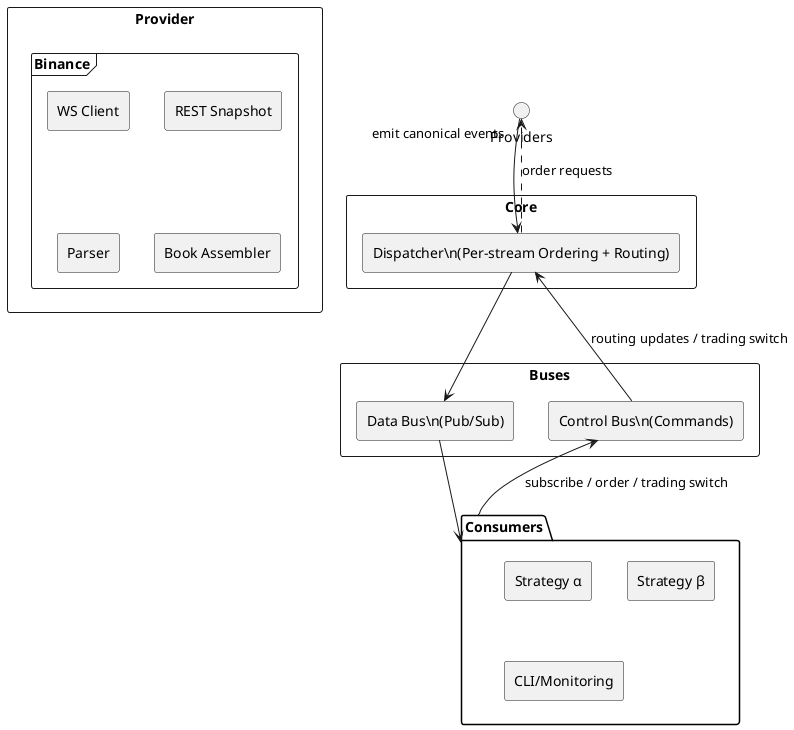

## Architecture Overview

The monolithic auto-trading application runs as a single Go process with immutable component boundaries. A single Binance provider ingests market and order events and forwards canonical events directly to the dispatcher, which enforces per-stream ordering and deduplication before delivering them to consumers over the in-process data bus. Control commands travel through a separate control bus that updates dispatcher routing tables and trading state.

### Component Responsibilities

| Boundary     | Responsibilities |
|--------------|------------------|
| **Providers** | Maintain exchange connections, normalize payloads into canonical events, and forward them to the dispatcher. |
| **Dispatcher** | Maintains routing tables, enforces per-stream ordering within 150 ms tolerance, stamps routing versions, deduplicates events, and guarantees ExecReport delivery. |
| **Buses** | Data Bus implements in-memory pub/sub channels for event delivery. Control Bus distributes subscribe, unsubscribe, and trading mode commands. |
| **Consumers** | Pure lambdas that receive ordered canonical events, manage trading switches and subscriptions, and submit orders routed through the dispatcher to provider adapters. Market-data events are suppressed locally whenever a routing flip is in progress; critical kinds (ExecReport, ControlAck, ControlResult) always propagate. |

### Data Flow Summary

1. Provider adapters ingest events from exchange WebSocket and REST endpoints, assemble canonical events (including checksum-verified order books), and push them directly to the dispatcher.
2. The dispatcher orders events per (provider, symbol, type), stamps the active routing version, routes events to subscribed consumers over the Data Bus, and forwards orders back to providers.
3. Consumers interact through the Control Bus to manage subscriptions and trading switches and receive execution reports and market data over the Data Bus.

### Performance & Memory Enhancements

- **Bounded Object Pools:** `PoolManager` coordinates five bounded pools (`WsFrame`, `ProviderRaw`, `Event`, `OrderRequest`, `ExecReport`) with 100 ms acquisition timeouts and double-Put detection. Debug builds poison returned objects and capture acquisition stacks to accelerate leak investigations.
- **WebSocket Transport:** Providers now rely on `github.com/coder/websocket`, enabling context-driven deadlines, native ping/pong, and lower frame overhead compared with the legacy gorilla client.
- **JSON Serialization:** All canonical serialization paths use `github.com/goccy/go-json`, reducing marshal/unmarshal latency and allocations while preserving API compatibility.
- **Fan-Out Clones & Recycler:** Dispatcher creates per-subscriber duplicates from `sync.Pool`, delivers them in parallel, and recycles the original via Recycler after enqueue loop. Recycler serves as the single return gateway for all structs (Dispatcher originals and Consumer deliveries). Debug poisoning catches use-after-put violations; double-put guards prevent lifecycle errors. Clones are allocated on the heap (unpooled), guaranteeing clone ownership by consumers.
- **Structured Concurrency:** All worker pools (including Dispatcher fan-out workers) use `github.com/sourcegraph/conc` (e.g., `conc.Group`, `conc/pool`) for better error handling, context propagation, and panic recovery. No `async/pool` usage.
- **Consumer Purity:** Consumers are pure lambdas that receive ordered canonical events and ignore stale market-data whenever a routing flip is underway (based on `routing_version`). Critical kinds (ExecReport, ControlAck, ControlResult) are always delivered and must not be ignored, ensuring lossless order lifecycle and control plane guarantees.
