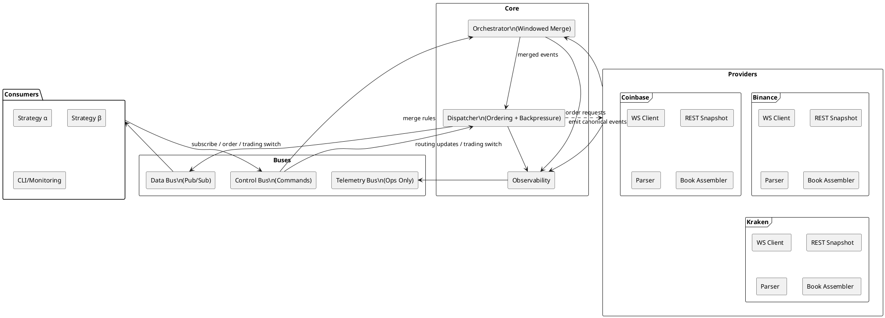

## Architecture Overview

The monolithic auto-trading application runs as a single Go process with immutable component boundaries. Providers ingest exchange-specific market and order events, the orchestrator performs windowed merging, and the dispatcher enforces per-stream ordering, fair-share backpressure, and delivery to consumers via the in-process data bus. Control commands travel through a separate control bus that updates routing tables and orchestrator merge rules.

### Component Responsibilities

| Boundary     | Responsibilities |
|--------------|------------------|
| **Providers** | Maintain exchange connections, normalize payloads into canonical events, assemble order books using REST snapshots plus diff streams, verify sequence and checksum integrity, and forward events to the orchestrator. |
| **Orchestrator** | Tracks merge windows keyed by symbol and event type, enforces 10s/1000-event closure rules, drops late fragments, suppresses partial windows, stamps merge IDs, and forwards complete windows to the dispatcher. |
| **Dispatcher** | Maintains routing tables, enforces per-stream ordering within 150 ms tolerance, deduplicates events, applies token-bucket backpressure with latest-wins coalescing for market data, and guarantees ExecReport delivery. |
| **Buses** | Data Bus implements in-memory pub/sub channels for event delivery. Control Bus distributes subscribe, unsubscribe, merged-subscribe, and trading mode commands. Telemetry Bus carries ops-only telemetry and optional DLQ messages. |
| **Consumers** | Pure lambdas that receive ordered canonical events, manage trading switches and subscriptions, and submit orders routed through the dispatcher to provider adapters. May ignore market-data during routing flips (based on `routing_version`); critical kinds (ExecReport, ControlAck, ControlResult) are always delivered. |
| **Observability** | Emits metrics, structured logs, and telemetry events (book resync, merge suppression, late drop, coalescing) tagged with trace and decision identifiers. |

### Data Flow Summary

1. Provider adapters ingest events from exchange WebSocket and REST endpoints, assemble canonical events, and push them to the orchestrator.
2. The orchestrator groups events into merge windows, emits only complete windows, and relays passthrough streams during single-provider flows.
3. The dispatcher orders events per (provider, symbol, type), applies backpressure and coalescing, routes events to subscribed consumers over the Data Bus, and forwards orders back to providers.
4. Consumers interact through the Control Bus to manage subscriptions and trading switches and receive execution reports and market data over the Data Bus.
5. Telemetry and metrics from all core components flow to the telemetry bus for ops-only monitoring.

### Performance & Memory Enhancements

- **Bounded Object Pools:** `PoolManager` coordinates six bounded pools (`WsFrame`, `ProviderRaw`, `Event`, `MergedEvent`, `OrderRequest`, `ExecReport`) with 100 ms acquisition timeouts and double-Put detection. Debug builds poison returned objects and capture acquisition stacks to accelerate leak investigations.
- **WebSocket Transport:** Providers now rely on `github.com/coder/websocket`, enabling context-driven deadlines, native ping/pong, and lower frame overhead compared with the legacy gorilla client.
- **JSON Serialization:** All canonical serialization paths use `github.com/goccy/go-json`, reducing marshal/unmarshal latency and allocations while preserving API compatibility.
- **Fan-Out Clones & Recycler:** Dispatcher creates per-subscriber duplicates from `sync.Pool`, delivers them in parallel, and recycles the original via Recycler after enqueue loop. Recycler serves as the single return gateway for all structs (Orchestrator partials, Dispatcher originals, Consumer deliveries). Debug poisoning catches use-after-put violations; double-put guards prevent lifecycle errors. Clones are allocated on the heap (unpooled), guaranteeing clone ownership by consumers.
- **Structured Concurrency:** All worker pools (including Dispatcher fan-out workers) use `github.com/sourcegraph/conc` (e.g., `conc.Group`, `conc/pool`) for better error handling, context propagation, and panic recovery. No `async/pool` usage.
- **Consumer Purity:** Consumers are pure lambdas that may ignore market-data during routing flips (based on `routing_version`). Critical kinds (ExecReport, ControlAck, ControlResult) are always delivered and must not be ignored, ensuring lossless order lifecycle and control plane guarantees.
