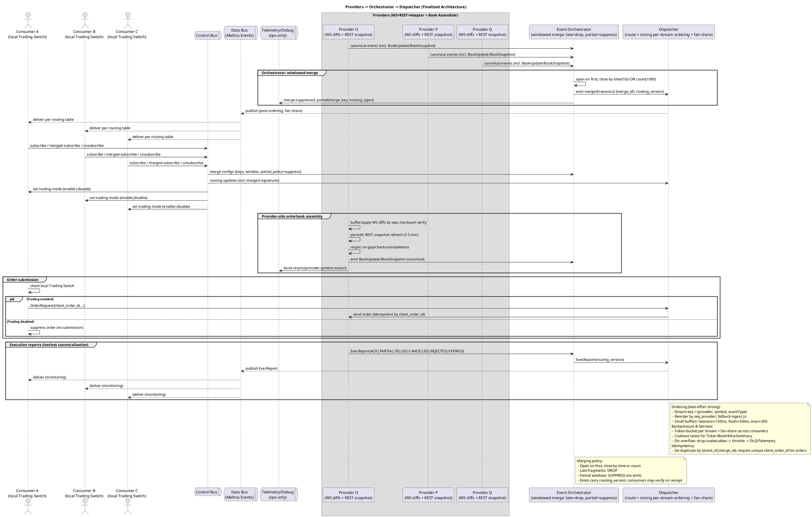

# Feature Specification: Monolithic Auto-Trading Application

**Feature Branch**: `003-build-a-monolithic`  
**Created**: October 12, 2025  
**Status**: Draft  
**Input**: User description: "Build a monolithic auto-trading application (non-HFT, loss-tolerant) using the immutable architecture below. Include the following UML as the authoritative system diagram and require that previous draft diagrams be replaced by this one."

## System Architecture Diagram

## User Scenarios & Testing

### User Story 1 - Real-time Market Data Consumption (Priority: P1)

A trading consumer subscribes to market data streams (order books, trades, tickers) from multiple exchange providers to monitor price movements and liquidity across markets. The system delivers consolidated, time-ordered events with provider attribution, allowing the consumer to make informed trading decisions based on current market conditions.

**Why this priority**: This is the foundational capability - without reliable market data delivery, no trading decisions can be made. This represents the core data pipeline.

**Independent Test**: Can be fully tested by subscribing a consumer to specific symbols from one or more providers and verifying that order book snapshots, updates, trades, and tickers arrive in correct sequence with timestamps within 200ms latency.

**Acceptance Scenarios**:

1. **Given** a consumer subscribes to BTC/USDT order book from Provider A, **When** the provider sends book snapshots and incremental updates, **Then** the consumer receives ordered events with correct bid/ask levels
2. **Given** multiple providers emit trade events for the same symbol, **When** events arrive at different times, **Then** the dispatcher delivers them ordered by provider sequence with latency under 200ms
3. **Given** a consumer is subscribed to 10 symbols across 3 providers, **When** high market activity occurs, **Then** all events are delivered without loss of execution reports and latest-wins coalescing applied to book updates

---

### User Story 2 - Dynamic Subscription Management (Priority: P1)

A trading consumer dynamically adds and removes market data subscriptions through control bus commands, adjusting their data feeds based on changing market conditions or strategy requirements. The system immediately updates routing tables and begins or stops delivering events for the requested symbols without disrupting existing subscriptions.

**Why this priority**: Essential for operational flexibility. Consumers must be able to adapt their data feeds in real-time as trading opportunities emerge or strategies change.

**Independent Test**: Can be tested by sending subscribe/unsubscribe control commands for various symbols and verifying routing table updates and event delivery starts/stops within one second.

**Acceptance Scenarios**:

1. **Given** a consumer has active subscriptions to 5 symbols, **When** they subscribe to 3 additional symbols, **Then** events for all 8 symbols are delivered within 1 second of the subscribe command
2. **Given** a consumer is receiving data for a symbol, **When** they unsubscribe from that symbol, **Then** no further events for that symbol are delivered within 1 second
3. **Given** multiple consumers subscribe to overlapping symbols, **When** one consumer unsubscribes, **Then** other consumers continue receiving events unaffected

---

### User Story 3 - Merged Multi-Provider Data Streams (Priority: P2)

A trading consumer requests merged market data where the same symbol from multiple providers is combined into windowed events with a single merge identifier. The system applies windowed merge logic (10-second window or 1000 events), drops late fragments, and suppresses partial windows, delivering only complete merged events that represent a coherent cross-provider view.

**Why this priority**: Advanced capability for arbitrage and cross-exchange analysis. Depends on basic subscription working first but provides significant value for sophisticated strategies.

**Independent Test**: Can be tested by configuring a merged subscription for a symbol available on 3 providers, sending events from each provider with varying latencies, and verifying that only complete windows with all providers present are emitted with merge_id.

**Acceptance Scenarios**:

1. **Given** a consumer subscribes to merged BTC/USDT from Providers A, B, C, **When** all three providers emit book snapshots within the 10-second window, **Then** a single merged event with merge_id is delivered containing all provider data
2. **Given** a merge window is open for a symbol, **When** Provider C's fragment arrives after the window closes (late), **Then** the late fragment is dropped and telemetry records the drop
3. **Given** a merge window closes with only 2 of 3 expected providers present, **When** the window timeout occurs, **Then** the partial window is suppressed (not emitted) and telemetry logs the suppression with missing provider details

---

### User Story 4 - Order Submission with Trading Switch Control (Priority: P1)

A trading consumer submits orders through the dispatcher when their local trading switch is enabled. Each order has a unique client_order_id for idempotency. The system routes orders to the appropriate provider, ensures no duplicate submissions, and respects the trading switch state to prevent accidental order submission when trading is disabled.

**Why this priority**: Core trading functionality - the application must safely execute trades. This is mission-critical and must work reliably from day one.

**Independent Test**: Can be tested by enabling a consumer's trading switch, submitting orders with unique client_order_ids, verifying orders reach the provider exactly once, then disabling the switch and confirming subsequent orders are suppressed locally.

**Acceptance Scenarios**:

1. **Given** a consumer's trading switch is enabled, **When** the consumer submits an order with client_order_id "ABC123", **Then** the order is forwarded to the provider exactly once
2. **Given** an order with client_order_id "ABC123" was already submitted, **When** the same consumer resubmits the same client_order_id, **Then** the duplicate is detected and not re-sent to the provider
3. **Given** a consumer's trading switch is disabled, **When** the consumer attempts to submit an order, **Then** the order is suppressed locally and never sent to the dispatcher or provider

---

### User Story 5 - Execution Report Delivery (Priority: P1)

When an order is submitted, the trading consumer receives execution reports tracking the order lifecycle through all states (ACK, PARTIAL, FILLED, CANCELLED, REJECTED, EXPIRED). The system delivers these reports losslessly with no coalescing, ensuring every state transition is visible to the consumer for accurate position tracking and risk management.

**Why this priority**: Critical for trading integrity - every execution report must be delivered to maintain accurate position and order state. Loss of execution data is unacceptable.

**Independent Test**: Can be tested by submitting an order, having the provider emit execution reports through the full lifecycle (ACK -> PARTIAL -> FILLED), and verifying every report reaches the consumer in order without loss.

**Acceptance Scenarios**:

1. **Given** an order is submitted and acknowledged, **When** the provider sends ACK, PARTIAL FILL, and FILLED reports, **Then** the consumer receives all three reports in order
2. **Given** high system load with backpressure, **When** execution reports and market data events compete for bandwidth, **Then** execution reports are never dropped while coalescable market data may be downsampled
3. **Given** an order is rejected by the provider, **When** the REJECTED execution report is sent, **Then** the consumer receives the rejection with the provider's reason code

---

### User Story 6 - Provider-Side Order Book Assembly (Priority: P2)

Each provider maintains accurate order books by buffering and applying WebSocket incremental updates sequenced correctly, verifying checksums, and periodically refreshing with REST snapshots (every 2-5 minutes). When gaps, checksum failures, or staleness are detected, the system triggers a resync automatically and emits telemetry for operational monitoring.

**Why this priority**: Important for data quality but secondary to delivering data. The system can function with best-effort books initially and improve accuracy over time.

**Independent Test**: Can be tested by simulating a WebSocket stream with sequenced updates, intentionally causing a gap or checksum mismatch, and verifying the system detects the issue, triggers a REST snapshot refresh, and emits telemetry.

**Acceptance Scenarios**:

1. **Given** a provider receives WebSocket order book diffs with sequence numbers 100, 101, 103, **When** the gap at 102 is detected, **Then** a REST snapshot refresh is triggered and telemetry records "book.resync{provider, symbol, reason=gap}"
2. **Given** a provider applies order book updates, **When** a checksum verification fails, **Then** the system discards the corrupted book state, fetches a new REST snapshot, and resumes normal operation
3. **Given** no book updates have been received for a symbol in 5 minutes, **When** the staleness threshold is exceeded, **Then** a proactive REST snapshot refresh is triggered

---

### User Story 7 - Fair-Share Bandwidth Management (Priority: P3)

When multiple consumers subscribe to overlapping or distinct streams under heavy market activity, the dispatcher applies fair-share token-bucket rate limiting to ensure no single consumer monopolizes bandwidth. Coalescable events (tickers, book summaries) are downsampled using latest-wins logic when necessary, while critical events (execution reports) are never dropped.

**Why this priority**: Operational robustness feature that prevents one consumer from starving others. Important for multi-strategy deployments but not critical for single-consumer MVP.

**Independent Test**: Can be tested by running 3 consumers subscribed to high-volume streams, simulating congestion, and verifying that each consumer receives a fair share of bandwidth with execution reports preserved and market data coalesced as needed.

**Acceptance Scenarios**:

1. **Given** three consumers are subscribed to high-volume market data, **When** the system approaches bandwidth limits, **Then** each consumer receives approximately equal bandwidth allocation
2. **Given** backpressure triggers coalescing, **When** 10 book updates arrive for a symbol in rapid succession, **Then** only the latest update is delivered to consumers while all 10 execution reports are delivered without coalescing
3. **Given** a consumer's token bucket is depleted, **When** new events arrive for that consumer, **Then** coalescable events are dropped and logged to telemetry/DLQ, but execution reports are queued and delivered

---

### Edge Cases

- **What happens when a provider WebSocket connection drops mid-stream?** The system must detect the disconnection, attempt reconnection with exponential backoff, fetch a REST snapshot upon reconnection, and resume normal operation without losing critical execution reports.
- **What happens when a merged subscription has only one provider active?** The system must suppress the merge (partial window policy) and emit telemetry indicating which providers are missing, preventing consumers from acting on incomplete data.
- **What happens when two consumers use the same client_order_id?** The system must treat each consumer's namespace as isolated, preventing cross-consumer collisions while detecting duplicates within a single consumer's order flow.
- **What happens when the orchestrator window closes by count (1000 events) before the time limit (10 seconds)?** The window must close immediately, emit the merged event, and open a new window for subsequent events.
- **What happens when a consumer sends a subscribe command while already subscribed to the same symbol?** The system should treat it as idempotent, not create duplicate subscriptions, and return acknowledgment that the subscription is active.
- **What happens when telemetry/DLQ storage fills up?** Telemetry is ops-only and should be configured with rotation/eviction policies. If DLQ is full, the oldest low-priority entries should be evicted to make room for new critical events.

## Requirements

**Compatibility Note**: Breaking APIs/import paths are allowed (CQ-08, GOV-04). Do not ship shims or feature flags for old contracts. Features MUST: use canonical, versioned event schemas (LM-02); respect immutable component boundaries (LM-01); enforce per‑stream ordering in Dispatcher with `seq_provider` buffer and `ingest_ts` fallback, no global ordering (LM-03); apply backpressure with latest‑wins for market data while NEVER dropping execution lifecycle events (LM-04); follow windowed merge rules (open on first, close by time or count; late=drop; partial=suppress) (LM-05); ensure idempotent orders via `client_order_id` and lossless ExecReport path (LM-06); assemble orderbooks provider-side with snapshot+diff, checksums, periodic event-driven refresh (LM-07); and keep observability ops-only with trace/decision IDs and DLQ (LM-08). Maintain `/lib` boundaries (ARCH-01/02).

### Functional Requirements

#### Provider Integration

- **FR-001**: System MUST connect to multiple exchange providers via WebSocket for real-time event streams and REST for snapshot retrieval
- **FR-002**: System MUST canonicalize provider-specific event formats into versioned schema events (BookUpdate, BookSnapshot, Trade, Ticker, ExecReport)
- **FR-003**: System MUST assemble order books provider-side by buffering and applying sequenced WebSocket diffs to a base REST snapshot
- **FR-004**: System MUST verify order book integrity using provider checksums and detect gaps in sequence numbers
- **FR-005**: System MUST trigger automatic REST snapshot refresh every 2-5 minutes or on-demand when gaps, checksum failures, or staleness are detected
- **FR-006**: System MUST emit telemetry events for book resync operations including provider, symbol, and reason (gap/checksum/staleness)

#### Event Orchestration

- **FR-007**: System MUST accept canonical events from all providers and route them through the orchestrator
- **FR-008**: System MUST support windowed merge for multi-provider events, opening a window on first fragment arrival
- **FR-009**: System MUST close merge windows by time threshold (10 seconds) OR count threshold (1000 events), whichever occurs first
- **FR-010**: System MUST drop late-arriving fragments that arrive after window closure and emit telemetry for dropped events
- **FR-011**: System MUST suppress (not emit) partial windows where expected providers are missing and log suppression with missing provider details
- **FR-012**: System MUST attach merge_id and routing_version to all merged events emitted to the dispatcher

#### Dispatch and Ordering

- **FR-013**: System MUST enforce per-stream ordering where stream key is (provider, symbol, eventType)
- **FR-014**: System MUST reorder events within a stream using seq_provider as primary sort key and ingest_ts as fallback
- **FR-015**: System MUST buffer events with lateness tolerance of approximately 150ms and flush interval of approximately 50ms, with maximum buffer size of 200 events per stream
- **FR-016**: System MUST de-duplicate events by event_id or merge_id to ensure exactly-once semantics
- **FR-017**: System MUST apply token-bucket rate limiting per stream with fair-share allocation across consumers
- **FR-018**: System MUST coalesce coalescable events (Ticker, Book, KlineSummary) using latest-wins policy when backpressure occurs
- **FR-019**: System MUST NEVER drop or coalesce execution reports (ExecReport) under any backpressure condition
- **FR-020**: System MUST log dropped coalescable events to telemetry/DLQ with context for operational analysis

#### Subscription Management

- **FR-021**: System MUST accept subscribe, unsubscribe, and merged-subscribe control commands from consumers via the control bus
- **FR-022**: System MUST update routing tables within 1 second of receiving subscription control commands
- **FR-023**: System MUST support overlapping subscriptions from multiple consumers without interference
- **FR-024**: System MUST support merged subscriptions where consumers receive windowed multi-provider events with merge_id
- **FR-025**: System MUST propagate merge configuration (keys, window parameters, partial_policy=suppress) from control bus to orchestrator

#### Order Submission and Execution

- **FR-026**: System MUST accept order requests from consumers with mandatory client_order_id for idempotency
- **FR-027**: System MUST enforce uniqueness of client_order_id per consumer to prevent duplicate order submission
- **FR-028**: System MUST route orders to the appropriate provider based on symbol and consumer configuration
- **FR-029**: System MUST respect each consumer's local trading switch state (enabled/disabled)
- **FR-030**: System MUST suppress order submission locally when a consumer's trading switch is disabled, without forwarding to dispatcher or provider
- **FR-031**: System MUST receive execution reports from providers in all lifecycle states (ACK, PARTIAL, FILLED, CANCELLED, REJECTED, EXPIRED)
- **FR-032**: System MUST deliver execution reports losslessly to all subscribed consumers without coalescing or dropping
- **FR-033**: System MUST route execution reports through orchestrator and dispatcher with routing_version for traceability

#### Control and Configuration

- **FR-034**: System MUST support control bus commands for setting trading mode (enable/disable) per consumer
- **FR-035**: System MUST propagate trading mode changes to consumers within 1 second
- **FR-036**: System MUST allow consumers to configure merge parameters including provider keys and window thresholds
- **FR-037**: System MUST support dynamic routing updates without requiring system restart

#### Observability

- **FR-038**: System MUST emit telemetry for all operational events to an ops-only telemetry bus, including trace IDs and decision IDs
- **FR-039**: System MUST maintain a dead-letter queue (DLQ) for events that cannot be delivered due to overflow or errors
- **FR-040**: System MUST log merge suppressions with merge_key and missing provider types
- **FR-041**: System MUST log book resync events with provider, symbol, and reason
- **FR-042**: System MUST provide metrics on per-stream latency, buffer utilization, and backpressure events

### Key Entities

- **Provider**: Represents an exchange or market data source with WebSocket and REST endpoints. Attributes include provider_id, name, symbols supported, connection state, and last_snapshot_time.

- **Canonical Event**: Abstract event type representing market data or execution lifecycle. Subtypes include BookSnapshot, BookUpdate, Trade, Ticker, ExecReport. Attributes include event_id, provider, symbol, eventType, seq_provider, ingest_ts, and type-specific payload.

- **OrderBook**: Represents the current state of bids and asks for a symbol at a provider. Assembled from REST snapshots and WebSocket diffs. Attributes include provider, symbol, sequence_number, checksum, bids (price levels), asks (price levels), last_update_time.

- **Merge Window**: Represents a time or count-bounded window for collecting multi-provider events. Attributes include merge_id, merge_key (symbol + event type), open_time, close_time, expected_providers, received_providers, status (open/closed/suppressed).

- **Stream**: Logical grouping of events by (provider, symbol, eventType) for ordering and backpressure management. Attributes include stream_key, buffer (event queue), seq_last_emitted, token_bucket_state.

- **Subscription**: Represents a consumer's request to receive events for specific symbols. Attributes include consumer_id, symbol, providers (list or "merged"), subscription_type (direct/merged), active (boolean).

- **Order**: Represents a trading order submitted by a consumer. Attributes include client_order_id, consumer_id, provider, symbol, side (buy/sell), order_type (limit/market), quantity, price (if limit), timestamp, state (pending/acknowledged/filled/cancelled/rejected).

- **Execution Report**: Represents a lifecycle event for an order. Attributes include exec_report_id, client_order_id, consumer_id, provider, symbol, state (ACK/PARTIAL/FILLED/CANCELLED/REJECTED/EXPIRED), filled_quantity, remaining_quantity, execution_price, timestamp.

- **Consumer**: Represents a trading application or strategy consuming market data and submitting orders. Attributes include consumer_id, name, trading_switch_enabled (boolean), active_subscriptions (list), order_history.

- **Routing Table**: Maps subscriptions to consumers, determining which events should be delivered to which consumers. Attributes include entries (list of {consumer_id, symbol, providers, subscription_type}), version (incremented on updates).

## Success Criteria

### Measurable Outcomes

- **SC-001**: System delivers market data events to consumers with end-to-end latency under 200ms (p99) during normal market conditions
- **SC-002**: System maintains per-stream ordering with zero out-of-order delivery for events within the 150ms lateness window
- **SC-003**: System delivers 100% of execution reports without loss or coalescing under all backpressure conditions
- **SC-004**: System applies fair-share bandwidth allocation ensuring no consumer receives less than 25% of their subscribed bandwidth when three or more consumers are active
- **SC-005**: System processes subscription changes (subscribe/unsubscribe) and updates routing tables within 1 second
- **SC-006**: System detects and recovers from order book gaps or checksum failures within 5 seconds via REST snapshot refresh
- **SC-007**: System prevents duplicate order submission with 100% accuracy when client_order_id is reused within a consumer session
- **SC-008**: System respects trading switch state with zero false positives (orders submitted when switch is disabled)
- **SC-009**: System completes merge windows within 10 seconds or 1000 events with 95% adherence to the configured threshold
- **SC-010**: System suppresses partial merge windows (missing providers) with zero false emissions of incomplete data
- **SC-011**: System supports at least 3 concurrent consumers each subscribed to 50 symbols across 3 providers without degradation
- **SC-012**: System maintains order book accuracy with checksum verification success rate above 99.5% during normal operation
