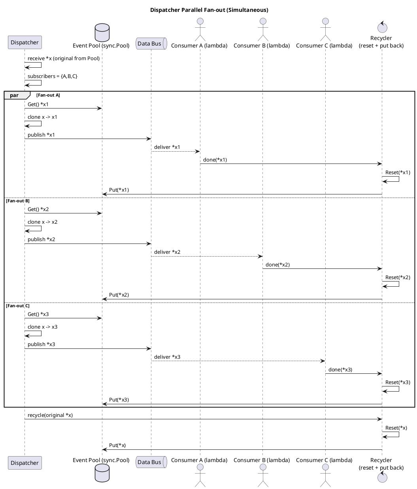
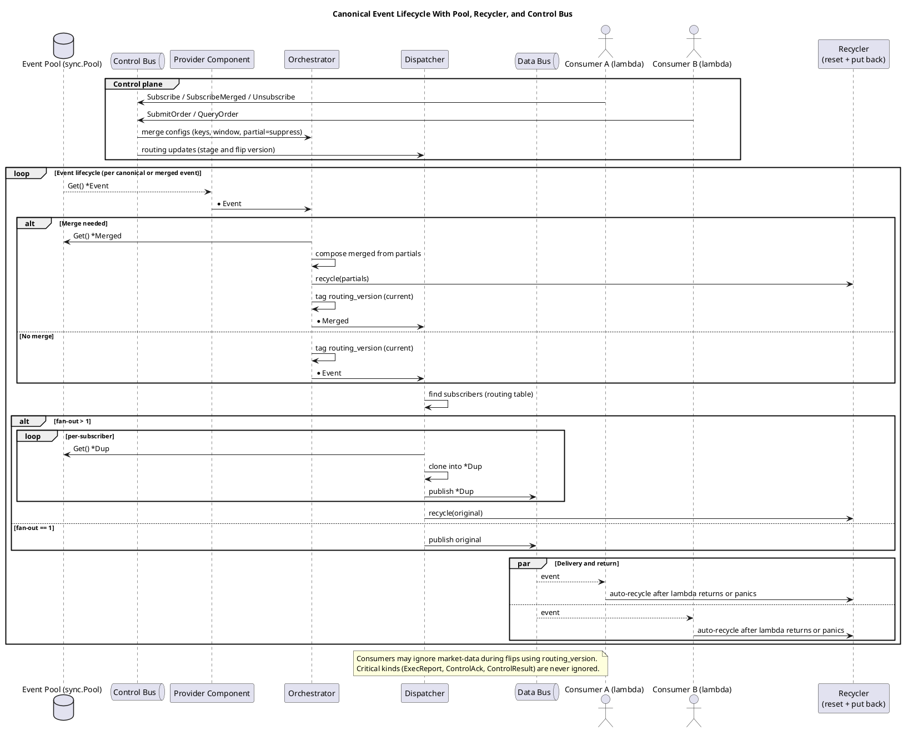

# Feature Specification: Event Distribution & Lifecycle Optimization

**Feature Branch**: `005-scope-of-upgrade`  
**Created**: 2025-10-14  
**Status**: Draft  
**Input**: User description: "Scope of upgrade (delta from prior NFR feature): Switch Dispatcher fan-out to pooled duplicates with parallel delivery; keep struct bus. Enforce Recycler-only Put() across the pipeline; Orchestrator sends partials to Recycler immediately after merge; Dispatcher sends the original to Recycler after fan-out; Consumer wrapper auto-recycles on return/panic. Consumers may ignore market-data during flips; critical kinds are never ignored by infra or consumers. Keep existing libraries: coder/websocket, goccy/go-json, sync.Pool. Concurrency goal: Replace any async/pool usage with github.com/sourcegraph/conc for structured concurrency."

## User Scenarios & Testing *(mandatory)*

### User Story 1 - Parallel Event Delivery to Multiple Consumers (Priority: P1)

When the trading system needs to broadcast a market data update to multiple active trading strategies simultaneously, the system delivers the event to all subscribers in parallel without blocking, ensuring each strategy receives the notification at the same time while maintaining memory efficiency through pooled resource reuse.

**Why this priority**: Parallel delivery directly impacts latency fairness across strategies. Sequential delivery would create unfair timing advantages for strategies that happen to be earlier in the delivery queue.

**Independent Test**: Can be fully tested by subscribing three strategies to the same symbol, publishing a price update, and verifying all three strategies receive the event within the same 10ms window while memory usage remains bounded (no unbounded allocation growth).

**Acceptance Scenarios**:

1. **Given** 5 trading strategies subscribed to BTC-USDT, **When** a price update arrives, **Then** all 5 strategies receive the update within 10ms of each other
2. **Given** 100 concurrent market data events being processed, **When** each event has 10 subscribers, **Then** memory allocations remain bounded and do not grow linearly with subscriber count
3. **Given** a high-frequency event stream with 1000 events/second, **When** delivered to multiple subscribers, **Then** no subscriber experiences degraded latency due to fan-out processing

---

### User Story 2 - Automatic Resource Cleanup on Consumer Completion (Priority: P1)

When a trading strategy finishes processing an event (either successfully or via panic/error), the system automatically reclaims the memory used by that event through a centralized cleanup mechanism, preventing memory leaks and ensuring consistent resource lifecycle management without requiring manual cleanup code in each strategy.

**Why this priority**: Memory leaks in long-running trading systems lead to eventual crashes and data loss. Automatic cleanup eliminates an entire class of bugs where developers forget to release resources.

**Independent Test**: Can be fully tested by processing 10,000 events through a consumer that panics on every 100th event, then verifying that all events (including those that triggered panics) have their memory properly reclaimed with zero leaks detected.

**Acceptance Scenarios**:

1. **Given** a consumer processes an event successfully, **When** the consumer function returns, **Then** the event memory is automatically reclaimed without manual cleanup
2. **Given** a consumer panics while processing an event, **When** the panic is caught, **Then** the event memory is still reclaimed before propagating the error
3. **Given** 1 million events processed over 24 hours, **When** checking memory usage, **Then** no memory growth is observed beyond baseline (no leaks)
4. **Given** partial merge events in the orchestrator, **When** a complete merge is emitted, **Then** all partial event memory is reclaimed immediately

---

### User Story 3 - Selective Market Data Filtering During Topology Changes (Priority: P2)

When the system is reconfiguring its routing topology (e.g., adding/removing providers, changing merge configurations), trading strategies can safely ignore market data updates during the transition period while still receiving critical execution reports and control acknowledgments, preventing strategies from making decisions based on potentially inconsistent merged data while ensuring order lifecycle events are never missed.

**Why this priority**: Stale or inconsistent market data during topology changes can cause incorrect trading decisions. However, missing execution reports would break order tracking. This feature enables safe topology changes without strategy downtime.

**Independent Test**: Can be fully tested by triggering a routing topology flip while simultaneously sending market data and execution reports, then verifying the consumer ignores market data but still receives and processes all execution reports.

**Acceptance Scenarios**:

1. **Given** a routing topology flip is in progress (routing_version has changed), **When** market data events arrive, **Then** consumers may skip processing these events
2. **Given** a routing topology flip is in progress, **When** an ExecReport (execution report) arrives, **Then** the consumer MUST receive and process it regardless of routing state
3. **Given** a routing topology flip is in progress, **When** a ControlAck or ControlResult message arrives, **Then** the consumer MUST receive and process it
4. **Given** normal operation (no topology flip), **When** any event arrives, **Then** all events are delivered normally regardless of type

---

### User Story 4 - Structured Error Handling in Concurrent Operations (Priority: P2)

When the system performs concurrent operations (such as fan-out delivery to multiple consumers or parallel worker processing), errors and panics in any worker are properly propagated, logged, and handled without silently failing or orphaning goroutines, providing operators with clear visibility into failures and enabling graceful degradation.

**Why this priority**: Silent failures in concurrent operations are difficult to debug and can lead to incorrect system state. Structured error handling ensures all failures are visible and properly handled.

**Independent Test**: Can be fully tested by configuring a consumer to fail with a specific error, triggering an event delivery, and verifying the error is properly captured, logged with full context (trace_id, consumer ID), and does not cause goroutine leaks.

**Acceptance Scenarios**:

1. **Given** one consumer in a fan-out group returns an error, **When** the error is encountered, **Then** it is logged with trace_id and consumer context but does not block delivery to other consumers
2. **Given** a worker pool is processing tasks, **When** one worker panics, **Then** the panic is recovered, logged, and the worker pool continues processing remaining tasks
3. **Given** concurrent fan-out operations, **When** any goroutine completes (success or failure), **Then** no goroutines are leaked (all goroutines terminate)
4. **Given** multiple errors occur during concurrent operations, **When** operations complete, **Then** all errors are aggregated and reported (not just the first error)

---

### Edge Cases

- **What happens when a consumer takes longer than expected to process an event?** System must not block other consumers or create backpressure that affects parallel delivery. Slow consumers should be tracked via telemetry.
- **What happens when the recycler receives the same event multiple times (double-put)?** System must detect and prevent double-put via guards, logging a warning with stack trace for debugging.
- **What happens when an event is accessed after being recycled (use-after-put)?** In debug mode, the system poisons recycled memory and panics on access with a clear error message indicating use-after-put violation.
- **What happens when parallel fan-out exceeds available memory pool capacity?** System must handle pool exhaustion gracefully by either blocking with timeout or falling back to heap allocation, with telemetry tracking pool contention.
- **What happens during a routing flip when hundreds of market data events are queued?** Consumers should efficiently skip stale market data based on routing_version while ensuring the queue doesn't grow unbounded.

## Requirements *(mandatory)*

**Compatibility Note**: Breaking APIs/import paths are allowed (CQ-08, GOV-04). Do not ship shims or feature flags for old contracts. Features MUST: use canonical, versioned event schemas (LM-02); respect immutable component boundaries (LM-01); enforce per‑stream ordering in Dispatcher with `seq_provider` buffer and `ingest_ts` fallback, no global ordering (LM-03); apply backpressure with latest‑wins for market data while NEVER dropping execution lifecycle events (LM-04); follow windowed merge rules (open on first, close by time or count; late=drop; partial=suppress) (LM-05); ensure idempotent orders via `client_order_id` and lossless ExecReport path (LM-06); assemble orderbooks provider-side with snapshot+diff, checksums, periodic event-driven refresh (LM-07); keep observability ops-only with trace/decision IDs and DLQ (LM-08); ALWAYS use goccy/go-json for JSON and FORBID encoding/json (PERF-04); use coder/websocket and FORBID gorilla/websocket (PERF-05); employ sync.Pool for canonical events and hot-path structs with race-free, bounded pools, fan-out duplicates from sync.Pool with parallel delivery, recycle via Recycler (PERF-06); follow Dispatcher fan-out ownership rules with Recycler as single return gateway, debug poisoning, double-put guards (clone per-subscriber unpooled; Put() original to Recycler after enqueue) (PERF-07); implement consumers as pure lambdas that may ignore market-data based on routing_version but ALWAYS deliver critical kinds (ExecReport, ControlAck, ControlResult) (PERF-08); use github.com/sourcegraph/conc for worker pools and FORBID async/pool (PERF-09). Maintain `/lib` boundaries (ARCH-01/02). When using Cursor/agents, append "use context7" for current library docs (GOV-06).

### Functional Requirements

#### Event Distribution & Parallelism

- **FR-001**: System MUST deliver events to multiple subscribers in parallel when fan-out count is greater than 1
- **FR-002**: System MUST create independent event copies for each subscriber from a memory pool to enable parallel processing
- **FR-003**: System MUST complete all parallel deliveries without one subscriber blocking another subscriber's delivery
- **FR-004**: System MUST track and report fan-out timing metrics (min/max/p95 delivery time across subscribers)

#### Resource Lifecycle & Memory Management

- **FR-005**: System MUST provide a single, centralized mechanism (Recycler) for returning all event structures to their memory pools
- **FR-006**: System MUST automatically reclaim event memory after consumer processing completes (successful return or panic)
- **FR-007**: System MUST reclaim partial merge events immediately after the orchestrator emits a complete merged event
- **FR-008**: System MUST reclaim the original event after the dispatcher completes fan-out delivery to all subscribers
- **FR-009**: System MUST detect and prevent double-put errors (returning the same event to pool multiple times)
- **FR-010**: System MUST provide debug mode that poisons recycled memory to detect use-after-put violations

#### Critical Event Delivery Guarantees

- **FR-011**: System MUST always deliver ExecReport (execution report) events to consumers regardless of routing topology state
- **FR-012**: System MUST always deliver ControlAck (control acknowledgment) events to consumers regardless of routing topology state  
- **FR-013**: System MUST always deliver ControlResult events to consumers regardless of routing topology state
- **FR-014**: System MUST tag all events with current routing_version to enable consumer filtering decisions
- **FR-015**: System MUST allow consumers to ignore market data events during routing topology transitions based on routing_version
- **FR-016**: System MUST NOT drop or filter critical events (ExecReport, ControlAck, ControlResult) at infrastructure level

#### Concurrency & Error Handling

- **FR-017**: System MUST use structured concurrency primitives for all worker pools and parallel operations
- **FR-018**: System MUST properly propagate errors from concurrent operations without silent failures
- **FR-019**: System MUST recover from panics in concurrent workers and log with full context (trace_id, worker ID, stack trace)
- **FR-020**: System MUST aggregate multiple errors from concurrent operations and report all failures
- **FR-021**: System MUST ensure no goroutine leaks when concurrent operations complete (success or failure)
- **FR-022**: System MUST provide cancellation support via context for all concurrent operations

#### Observability & Debugging

- **FR-023**: System MUST emit telemetry when memory pool capacity is exceeded or acquisition times out
- **FR-024**: System MUST log warnings with stack traces when double-put is detected
- **FR-025**: System MUST track and report consumer processing latency per consumer
- **FR-026**: System MUST emit metrics for parallel fan-out performance (degree of parallelism, completion time)
- **FR-027**: System MUST provide debug tooling to capture memory allocation stacks for leak investigation

### Key Entities

- **Event**: Canonical market data or order lifecycle message with routing_version tag, trace_id, and event kind (market-data, ExecReport, ControlAck, ControlResult). Allocated from memory pool, delivered to consumers, and recycled via Recycler after use.

- **Recycler**: Centralized resource return gateway that receives events from all pipeline stages (Orchestrator partial merges, Dispatcher fan-out originals, Consumer completions), performs reset/poisoning, validates against double-put, and returns structures to appropriate memory pools.

- **Consumer Wrapper**: Infrastructure component that wraps consumer lambda functions to provide automatic resource cleanup on return or panic, routing_version-based filtering for market-data, and guaranteed delivery of critical events.

- **Fan-out Duplicate**: Per-subscriber event copy created from memory pool during parallel delivery. Independent lifecycle from original event; owned by subscriber until consumer wrapper recycles it.

## Success Criteria *(mandatory)*

### Measurable Outcomes

- **SC-001**: Event delivery to 10 subscribers completes within 15ms total (parallel processing), compared to 100ms+ for sequential delivery
- **SC-002**: System processes 1 million events over 24 hours with zero memory growth beyond baseline (no leaks)
- **SC-003**: Memory pool utilization remains below 80% under normal load (1000 events/second with 10 subscribers per event)
- **SC-004**: 100% of critical events (ExecReport, ControlAck, ControlResult) are delivered during routing topology flips, while market data filtering operates correctly
- **SC-005**: Zero goroutine leaks detected after processing 100,000 events with random consumer panics (10% panic rate)
- **SC-006**: Error propagation captures and reports 100% of concurrent operation failures with full context (no silent failures)
- **SC-007**: Debug mode detects 100% of use-after-put violations within 1 event of the violation occurring
- **SC-008**: Double-put detection catches 100% of duplicate recycle attempts and prevents pool corruption
- **SC-009**: Parallel fan-out achieves >90% efficiency (actual parallelism / theoretical parallelism) for fan-out groups of 5+ subscribers
- **SC-010**: System handles routing topology flips with zero execution report loss and <5% market data delivery during flip window

## Assumptions

1. **Subscriber Count**: Normal operation has 5-20 subscribers per event; extreme cases may reach 50 subscribers
2. **Event Rate**: System processes 500-2000 events/second under normal trading conditions
3. **Memory Pool Sizing**: Pools are pre-sized to handle 3x peak concurrent event count to minimize allocation failures
4. **Routing Flip Frequency**: Topology changes occur <10 times per day and last <500ms each
5. **Critical Event Ratio**: Critical events (ExecReport, ControlAck, ControlResult) represent <10% of total event volume
6. **Consumer Processing Time**: Normal consumers complete in <50ms; slow consumers may take up to 1 second
7. **Error Rate**: Under normal conditions, <1% of consumer invocations result in errors or panics

## Architecture Diagrams

### Dispatcher Parallel Fan-out (Simultaneous)

### Canonical Event Lifecycle With Pool, Recycler, and Control Bus

## Out of Scope

- Changes to event schema or canonical event structure
- Modifications to provider adapters or connection logic
- Changes to windowing or merge logic in Orchestrator
- Modifications to ordering semantics in Dispatcher
- Changes to WebSocket or JSON serialization libraries
- New consumer types or subscription patterns
- Performance optimization of individual consumer logic
- Changes to backpressure or coalescing policies
- Modifications to telemetry schema or metrics collection

## Dependencies

- Existing `sync.Pool` infrastructure for event pooling
- Current Data Bus and Control Bus implementations
- Orchestrator merge window logic
- Dispatcher routing table and ordering logic
- Provider canonical event generation
- Observability framework (trace_id, metrics, logging)
